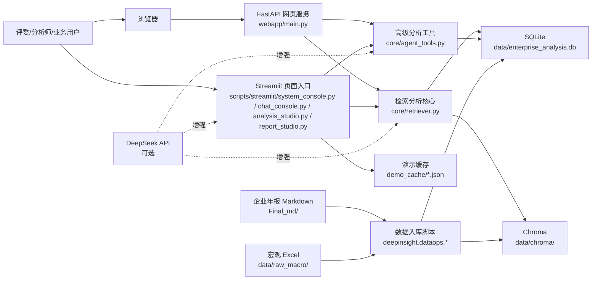
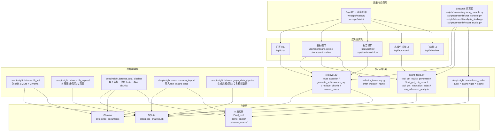
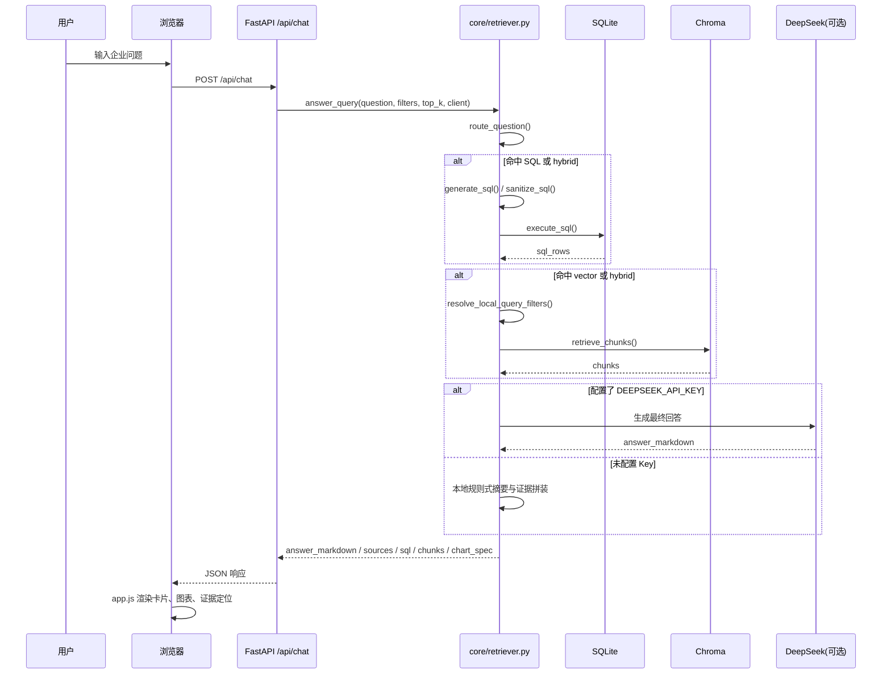
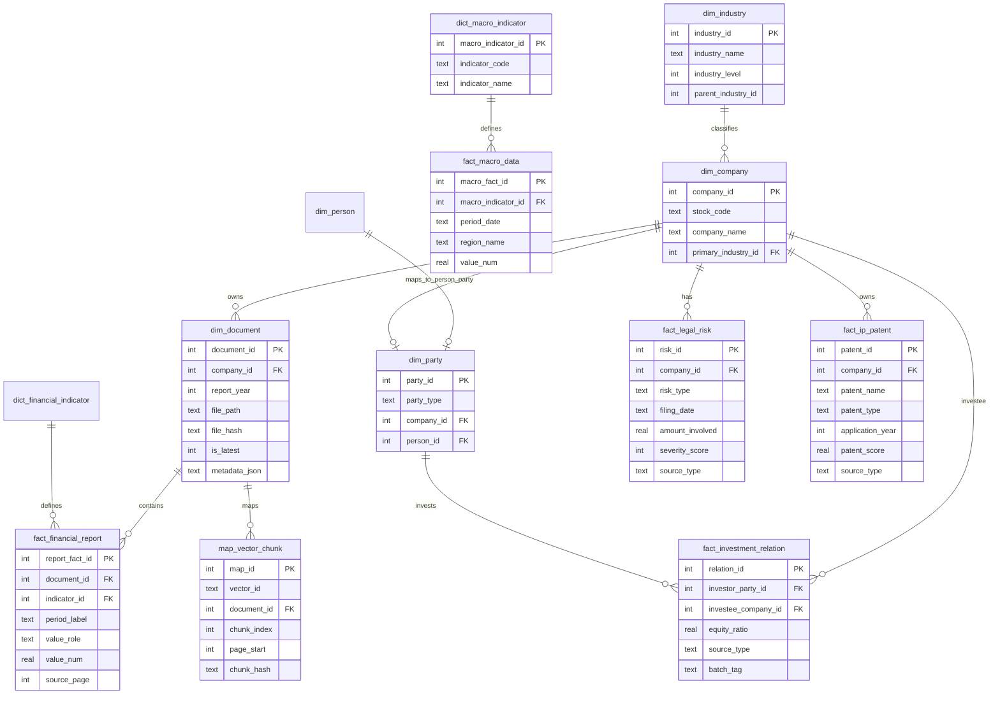
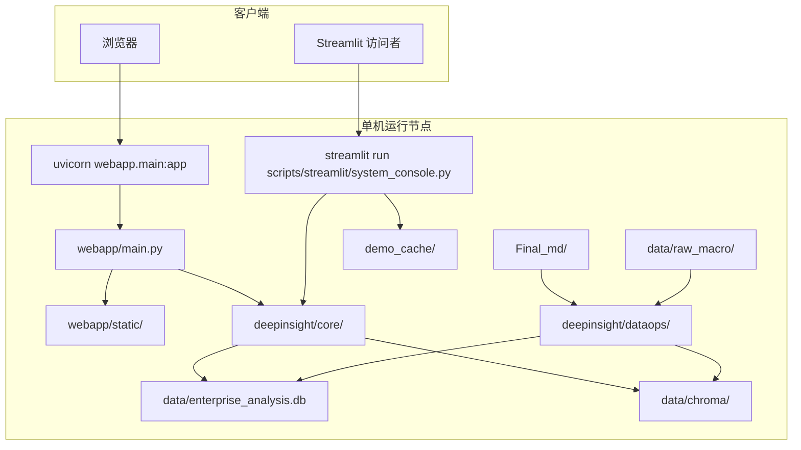

# 项目架构说明

## 第一步：识别到的模块与图表清单

### 已识别模块

- 启动脚本与命令入口：`scripts/streamlit/`、`Makefile`、`python -m deepinsight.dataops.*`
- Streamlit 展示层：`deepinsight/apps/`
- FastAPI 自建网页：`webapp/main.py`、`webapp/static/`
- 核心检索与分析：`deepinsight/core/retriever.py`、`deepinsight/core/agent_tools.py`
- 行业映射与 UI 共用能力：`deepinsight/core/industry_taxonomy.py`、`deepinsight/core/ui_common.py`
- 数据构建与入库：`deepinsight/dataops/db_init.py`、`deepinsight/dataops/db_expand.py`、`deepinsight/dataops/data_pipeline.py`、`deepinsight/dataops/macro_import.py`、`deepinsight/dataops/graph_data_pipeline.py`
- 演示缓存：`deepinsight/demo/demo_cache.py`
- 配置与路径：`deepinsight/config.py`
- 测试：`tests/`
- 数据与资源目录：`data/`、`Final_md/`、`demo_cache/`、`assets/`

### 准备输出的图表

- 系统上下文图
- 模块/分层架构图
- 核心业务时序图
- 数据模型/ER 图
- 部署架构图

## 第二步：正式架构说明

## 1. 项目架构总览

该项目是一个面向医药生物行业的企业运营分析与决策支持系统，目标是把年报 Markdown、结构化财务事实、宏观指标、股权/风险/专利扩展信息整合到同一套可展示、可追溯的分析链路中。系统同时保留了 `Streamlit` 比赛版入口和 `FastAPI` 自建网页入口，底层统一依赖 `SQLite` 作为结构化事实库、`Chroma` 作为向量检索库，并通过 `DeepSeek` 作为可选增强能力。核心模块包括数据构建层、检索分析层、展示交互层、演示缓存层和测试层。总体调用关系是：`dataops` 先构建数据库与向量库，`core` 层在运行时完成 SQL、RAG 和高级工具分析，`apps` 与 `webapp` 再将这些能力封装成页面和接口对外提供服务。当前架构风格更接近单仓单体应用，带有“前后端分离网页 + Streamlit 多入口并存”的混合展示形态，而不是微服务或事件驱动架构。

## 2. 系统上下文图



### 图说明

- 这张图说明了系统对外的真实参与者、交互入口和外部依赖。
- 关键目录与模块：`webapp/main.py`、`deepinsight/apps/`、`deepinsight/core/retriever.py`、`deepinsight/core/agent_tools.py`、`deepinsight/dataops/`、`Final_md`。
- 当前设计优点：单仓内闭环完整，数据构建、分析和展示共用同一底座，适合比赛快速迭代与本地演示。
- 潜在风险与技术债：`Streamlit` 与 `FastAPI` 两套入口并存，页面能力不完全一致；`DeepSeek` 是可选增强，缺失时体验会退化；`graph_data_pipeline.py` 当前写入的是模拟扩展数据。

## 3. 模块/分层架构图



### 图说明

- 这张图说明了仓库内部的分层关系，以及 `webapp`、`apps`、`core`、`dataops`、存储层之间的依赖方向。
- 关键目录与接口：`webapp/main.py` 的 `/api/chat`、`/api/dashboard`、`/api/workflow`、`/api/advanced`；`deepinsight/core/retriever.py`；`deepinsight/core/agent_tools.py`；`deepinsight/dataops/*.py`。
- 当前设计优点：核心能力集中在 `deepinsight/core`，数据构建集中在 `deepinsight/dataops`，便于复用到 Streamlit 和 FastAPI 两个入口。
- 潜在风险与技术债：当前没有独立 service layer 或 repository layer，`webapp/main.py` 自身承载了较多聚合查询逻辑；原始 SQL 分散在多个模块中，后续维护成本较高。

## 4. 核心业务时序图

以下选择“企业问答”作为最关键业务流程。



### 图说明

- 这张图说明了问答主链路如何把 SQL、RAG 和可选 LLM 组合到一次请求里。
- 关键模块与接口：`webapp/main.py` 的 `/api/chat`，`deepinsight/core/retriever.py` 的 `answer_query`、`route_question`、`generate_sql`、`execute_sql`、`retrieve_chunks`。
- 当前设计优点：支持降级运行；即使没有 `DEEPSEEK_API_KEY`，也能通过本地 SQL + RAG 给出证据驱动回答。
- 潜在风险与技术债：`retriever.py` 同时承担路由、SQL 生成、SQL 执行、向量检索、总结生成等多种职责；对单文件的依赖较重。

## 5. 数据模型 / ER 图

以下 ER 图优先展示当前主链路和高级分析会访问到的核心表。



### 图说明

- 这张图说明了 SQLite 中的主事实表、维表和图谱扩展表之间的关系。
- 关键文件：`deepinsight/dataops/db_init.py`、`deepinsight/dataops/db_expand.py`。
- 当前设计优点：主链路财务问答和宏观联动使用清晰的星型/雪花型结构；文档维度和向量 chunk 映射也已落库，便于溯源。
- 潜在风险与技术债：图谱扩展表没有单独的数据采集链路，当前主要由 `graph_data_pipeline.py` 生成模拟数据；`metadata_json` 承载半结构化信息，后续查询能力有限。

## 6. 部署架构图

仓库中没有 Docker、Kubernetes、Nginx 或云部署编排文件，因此以下图为“基于 `Makefile`、README 和入口代码推断的本地单机部署示意”。



### 图说明

- 这张图说明了当前代码所支持的真实部署形态更接近“本地单机进程 + 本地文件系统 + 本地数据库/向量库”。
- 关键命令与文件：`Makefile`、`webapp/main.py`、`scripts/streamlit/system_console.py`。
- 当前设计优点：部署门槛低，适合比赛展示、录屏和离线演示。
- 潜在风险与技术债：未看到容器化、环境隔离、反向代理、鉴权、多用户并发或集中式存储设计；`SQLite + 本地 Chroma` 更适合单机场景，不适合高并发生产环境。

## 7. 架构问题清单

- `FastAPI` 网页与 `Streamlit` 入口长期并存，功能重叠但并不完全一致，存在维护分叉风险。
- `webapp/main.py` 承载了较多聚合查询与组装逻辑，缺少独立 service 层。
- `deepinsight/core/retriever.py` 职责过重，耦合了问题路由、SQL 生成、SQL 执行、RAG 检索、结果组织与可选 LLM。
- 高级分析扩展表虽然已经建模，但 `graph_data_pipeline.py` 当前以 `mock` 方式生成股权、风险和专利数据。
- 演示缓存 `demo_cache` 只在 `Streamlit` 主入口中接入，FastAPI 网页目前未统一使用。
- 仍以原始 SQL 和本地路径为主，缺少 repository 抽象、统一配置对象和环境分层。
- 白盒页面 `scripts/streamlit/trace_console.py` 对应的核心能力当前仍带有示例型 mock 展示，不是与主问答链路完全复用的实时能力。

## 8. 优化建议清单

- 把 `webapp/main.py` 中的聚合查询下沉到独立 application service 模块，统一给 FastAPI 和 Streamlit 复用。
- 拆分 `retriever.py`，至少拆成路由、SQL、向量检索、答案组装四类职责。
- 为高级分析扩展表补真实采集/导入链路，替代 `mock` 数据生成逻辑。
- 统一 FastAPI 与 Streamlit 的演示缓存接入策略，避免双入口体验差异。
- 用配置对象或 settings 模块集中管理 API Key、路径、模型、阈值等运行参数。
- 为 SQLite/Chroma 增加更明确的数据版本、构建批次与审计信息，便于追踪数据来源。
- 如果后续走多用户或线上部署，优先考虑把 SQLite 升级到服务端数据库，并评估独立向量服务。

## 9. 假设与待确认项

- 部署架构图中的“单机运行”来自 `Makefile`、README 和当前代码入口，仓库中未发现正式生产部署编排文件。
- FastAPI 网页是否计划完全替代 `Streamlit`，代码中无法确认，只能确认当前两个入口都存在。
- 高级分析扩展表是否未来会接真实外部数据源，仓库中无法确认；当前可确认的是 `graph_data_pipeline.py` 会生成 `mock` 数据。
- `cache_tools.py` 中的语义缓存能力在主链路中的实际启用范围无法完全确认；从当前代码看，演示缓存更明确的是 `demo_cache/` JSON 方案。
- 是否存在额外的离线构建、CI/CD、容器部署、权限控制或多租户要求，仓库内容无法确认。

## 第二天开发前结构检查

本节记录 2026-07-21 在 `main` 分支进行的第二天开发前结构检查。检查只基于当前仓库代码、README、配置和测试文件，不重新联网核验外部来源，不接入大模型，不下载模型。

### 1. 当前技术栈

- Web 展示存在两套入口：`FastAPI` 同源静态前端和 `Streamlit` 多页面入口。
- 后端/API 框架为 `FastAPI`，入口文件是 `webapp/main.py`，通过 `uvicorn webapp.main:app` 启动。
- Streamlit 入口位于 `scripts/streamlit/`，主入口为 `scripts/streamlit/system_console.py`，薄封装调用 `deepinsight.apps.app_system.main()`。
- 前端静态页面位于 `webapp/static/index.html`，构建源位于 `webapp/frontend_src/`；页面通过 `fetch` 调用 `/api/*`，不是直接调用 Python 函数。
- 当前企业经营分析主数据读取来自 `SQLite` 和 `Chroma`：路径由 `deepinsight/config.py` 定义为 `data/enterprise_analysis.db` 与 `data/chroma/`。
- 第一版 NSCLC 证据数据当前为独立 CSV/JSON：`data/source_registry.csv`、`config/entity_aliases.json`、`config/evidence_rules.json`，最小查询脚本为 `scripts/query_source_registry.py`。
- 依赖文件为 `requirements.txt`，包含 `streamlit`、`fastapi`、`uvicorn`、`chromadb`、`sentence-transformers`、`openai`、`requests` 等。

### 2. 项目启动入口

- FastAPI：`python -m uvicorn webapp.main:app --host 127.0.0.1 --port 8000`，与 README 和 `Makefile web` 基本一致。
- Streamlit 主控制台：`streamlit run scripts/streamlit/system_console.py`，与 README 和 `Makefile run` 一致。
- 其他 Streamlit 页面：`chat_console.py`、`analysis_studio.py`、`stakeholder_console.py`、`trace_console.py`、`report_studio.py`，记录在 `scripts/README.md`。
- 数据与缓存脚本：`python3 -m deepinsight.dataops.*`、`python3 -m deepinsight.demo.demo_cache`。
- 第一版来源校验与命令行查询：`python3 scripts/validate_source_registry.py`、`python3 scripts/query_source_registry.py --summary`。

### 3. 后端/API结构

- FastAPI 应用对象在 `webapp/main.py` 的 `app = FastAPI(...)`。
- API 路由集中在 `webapp/main.py`：`/api/bootstrap`、`/api/dashboard`、`/api/profile`、`/api/compare`、`/api/timeline`、`/api/database/catalog`、`/api/database/table`、`/api/data-room/catalog`、`/api/data-room/preview`、`/api/chat`、`/api/workflow`、`/api/batch-workflow`、`/api/advanced`、`/api/whitebox`。
- 当前没有独立的 API router 文件或 service layer；`webapp/main.py` 同时承担请求模型、路由、数据库聚合函数和响应组装。
- `/api/chat` 调用 `deepinsight.core.retriever.answer_query()`；`/api/workflow` 调用 `deepinsight.apps.workflow_report.run_workflow()`；`/api/advanced` 调用 `deepinsight.core.agent_tools.run_advanced_analysis()`。

### 4. Web页面结构

- FastAPI 静态前端入口为 `webapp/static/index.html`。
- 前端源文件位于 `webapp/frontend_src/`，其中 `component.js` 通过 `_api()` 和 `_apiPost()` 调用 `/api/*`。
- Streamlit 页面入口位于 `scripts/streamlit/`，具体页面逻辑位于 `deepinsight/apps/`。
- Streamlit 主页面 `deepinsight/apps/app_system.py` 包含基础问答、角色分析、自动化报告、企业图谱、白盒追踪和状态页签。
- `deepinsight/core/ui_common.py` 包含共用渲染函数，并使用 `streamlit.components.v1.components.html` 的封装函数 `render_html_component()`。

### 5. 数据存储位置

- 结构化企业经营数据：`data/enterprise_analysis.db`，由 `deepinsight/config.py` 的 `DB_PATH` 指定；当前仓库中未直接列出该文件，但代码默认读取该路径。
- 向量库：`data/chroma/`，由 `CHROMA_DIR` 指定；当前仓库中未直接列出该目录内容，但代码默认读取该路径。
- 宏观样例数据：`data/raw_macro/国家统计局_卫生_2022_2024.xlsx`。
- 第一版证据登记表：`data/source_registry.csv`。
- 证据规则和别名：`config/evidence_rules.json`、`config/entity_aliases.json`。
- 演示缓存：`demo_cache/*.json`。

### 6. 当前查询链路

企业查询：

```text
用户在 FastAPI 静态页选择企业或打开仪表盘
→ webapp/static/index.html / webapp/frontend_src/component.js 调用 /api/profile、/api/dashboard、/api/compare、/api/timeline
→ webapp/main.py 中 profile/dashboard/compare/timeline 路由
→ fetch_company_profile_dashboard、fetch_company_trend_dashboard、fetch_compare_matrix_dashboard、fetch_company_timeline_dashboard 等函数
→ deepinsight.core.retriever.get_connection(DEFAULT_DB_PATH)
→ data/enterprise_analysis.db
→ 页面返回企业画像、趋势、对比或时间线 JSON
```

药物查询：

```text
当前不存在已接入 Web 或 FastAPI 的药物查询链路
→ 已存在命令行链路 scripts/query_source_registry.py --drug
→ load_registry() 读取 data/source_registry.csv，load_aliases() 读取 config/entity_aliases.json
→ query_rows() 使用 drug_names、intervention、title、notes 和别名扩展进行过滤
→ 命令行返回 table 或 json
```

临床试验或证据查询：

```text
当前不存在已接入 Web 或 FastAPI 的 NSCLC 证据查询链路
→ 已存在命令行链路 scripts/query_source_registry.py --trial-id / --pmid / --study-name / --text
→ load_registry() 读取 data/source_registry.csv
→ query_rows() 使用 registry_id、parent_trial_id、pmid、study_name、notes 等字段过滤
→ 命令行返回来源、状态和链接
```

图谱查询：

```text
用户在 Streamlit 主页面进入“企业图谱”页签，或 FastAPI 静态页调用 /api/advanced
→ deepinsight/apps/app_system.py 的 render_graph_tab()，或 webapp/main.py 的 advanced()
→ deepinsight.core.agent_tools.run_advanced_analysis()
→ tool_get_equity_penetration()、tool_get_risk_radar()、tool_get_innovation_index()
→ deepinsight.core.retriever.get_connection(DEFAULT_DB_PATH)
→ data/enterprise_analysis.db 中股权、风险、专利相关表
→ Streamlit 或 FastAPI 前端返回图谱、雷达和工具来源摘要
```

Web页面展示：

```text
浏览器访问 /
→ webapp/main.py 的 index()
→ 读取 webapp/static/index.html
→ 静态前端通过 fetch 调用 /api/bootstrap、/api/chat、/api/workflow、/api/advanced 等
→ webapp/main.py 聚合结果
→ 页面渲染卡片、图表、证据列表和报告内容
```

演示缓存读取：

```text
Streamlit 主页面开启演示缓存
→ deepinsight/apps/app_system.py 的 render_basic_chat_tab()、render_workflow_tab()、render_graph_tab()
→ deepinsight.demo.demo_cache.get_chat_cache()、get_workflow_cache()、get_advanced_cache()
→ demo_cache/*.json
→ 命中则返回缓存结果；未命中则调用 answer_query()、run_workflow() 或 run_advanced_analysis()
```

### 7. 建议的第二天接入链路

建议按以下最小链路接入，不新建第二套后端或 Web 框架：

```text
data/source_registry.csv
→ 统一证据查询服务
→ 现有 FastAPI 路由或 Streamlit 页面调用层
→ Web 证据查询页面
→ 来源、证据等级和风险提示
```

当前项目已有独立 FastAPI 服务，因此第二天优先接入 `webapp/main.py` 的现有 API 体系；Streamlit 可作为备用展示入口，不建议同时开发两套完整页面。

### 8. 建议新增或修改的文件

- 统一查询服务：建议新建 `deepinsight/core/source_registry_service.py`，从 `scripts/query_source_registry.py` 抽取可复用逻辑，负责读取 CSV、别名、证据规则并返回结构化结果。
- API 路由：建议在 `webapp/main.py` 中以最小改动新增 `/api/evidence/sources`、`/api/evidence/summary` 或同类路由；如路由继续增长，再拆出 router 文件。
- Web 证据查询页面：优先修改 `webapp/frontend_src/component.js` 和重新生成 `webapp/static/index.html`，在现有静态前端中增加证据查询视图；若选择 Streamlit，则修改 `deepinsight/apps/app_system.py` 新增页签。
- 查询服务测试：建议新建或扩展 `tests/test_source_registry_service.py`。
- API 测试：建议新建 `tests/test_evidence_api.py`，复用 FastAPI TestClient 或现有测试风格。
- 第二天验证报告：建议放在 `docs/day2_query_service_validation.md`。
- 不建议第二天修改 `data/source_registry.csv`、`config/evidence_rules.json`、`config/entity_aliases.json` 的事实内容，除非发现明确结构错误。

### 9. 双人协作时容易冲突的文件

| 文件 | 冲突原因 | 建议负责人 |
|---|---|---|
| `webapp/main.py` | FastAPI 应用入口、路由和聚合函数集中在同一文件。 | 后端/API负责人 |
| `webapp/frontend_src/component.js` | 静态前端主要交互逻辑集中在单文件。 | 前端负责人 |
| `webapp/static/index.html` | 构建产物，容易与前端源文件同时冲突。 | 前端负责人，最好由同一人生成 |
| `deepinsight/apps/app_system.py` | Streamlit 主页面和多个页签集中在单文件。 | Web/演示负责人 |
| `deepinsight/core/retriever.py` | 现有问答主链路核心文件，职责重。 | 检索负责人，第二天尽量不直接改 |
| `scripts/query_source_registry.py` | 第一版命令行查询工具，后续服务抽取时容易与测试同步冲突。 | 数据查询负责人 |
| `tests/test_source_registry_query.py` | 现有查询测试基线。 | 测试负责人或数据查询负责人 |
| `README.md` | 启动说明和项目状态容易被多人同时更新。 | 文档负责人 |
| `docs/decision_log.md` | 所有阶段记录集中写入。 | 文档负责人 |
| `requirements.txt` | 依赖变更影响全员环境；第二天不建议新增依赖。 | 项目负责人 |

### 10. 当前风险和阻塞项

- 中等风险：第一版 NSCLC 证据查询仍只在命令行脚本中，尚未进入 `deepinsight/core` 服务层或 FastAPI 路由。
- 中等风险：`webapp/main.py` 目前没有独立 router/service 分层，继续直接堆叠路由会增加冲突和维护成本。
- 中等风险：`webapp/static/index.html` 是静态构建产物，若直接手改容易与 `webapp/frontend_src/` 不一致。
- 低风险：`SemanticCache` 在 `deepinsight/core/cache_tools.py` 中延迟加载 `sentence-transformers`，只有启用语义缓存并首次使用时才会初始化模型；第二天验证应避免触发该路径。
- 低风险：`deepinsight/experiments/` 仍存在 mock LLM 实验代码，但不在当前 Web/API 主链路；`config/evidence_rules.json` 和文档中的 `random`、`MOCK` 是禁止规则说明。
- 低风险：`deepinsight/core/agent_tools.py` 仍存在企业经营旧口径中的 0-100 雷达评分逻辑，第二天 NSCLC 证据规则不应复用该固定评分口径。
- 已纠正认知：当前 `deepinsight/dataops/graph_data_pipeline.py` 是图谱快照查询脚本，未发现 `Faker`、`random` 或 mock 写入函数；旧章节中关于该文件生成 mock 数据的说法应以后续清理为准。
