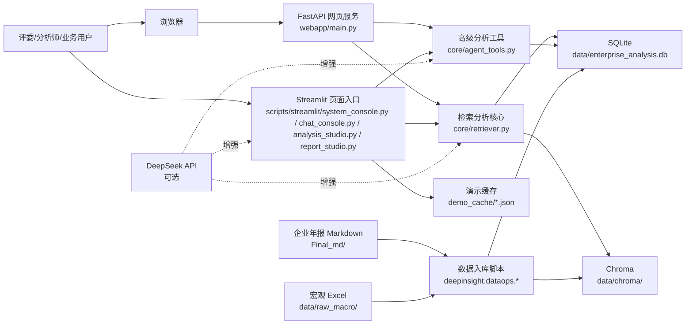
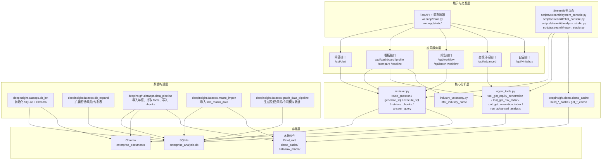
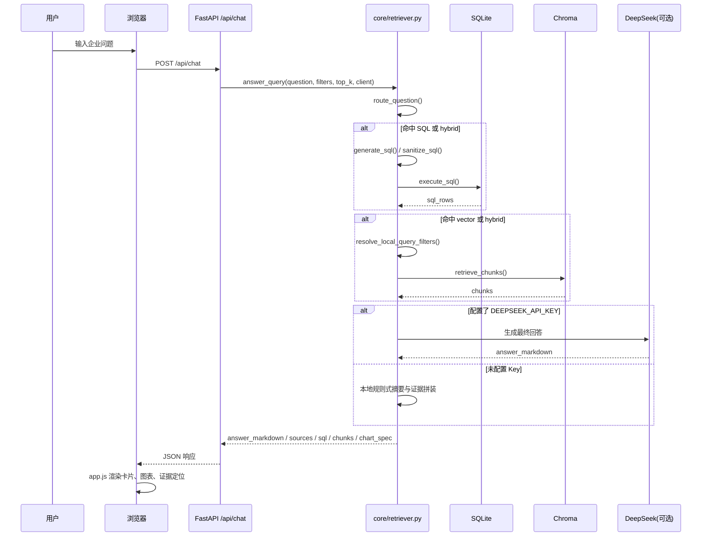
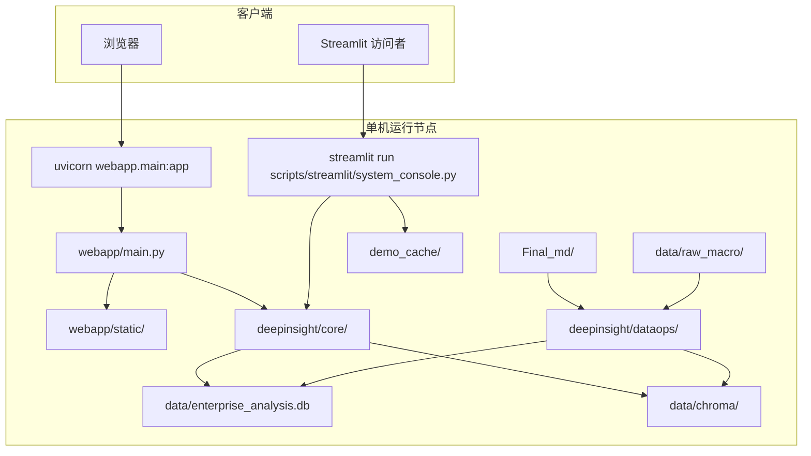

# 项目架构说明

## 第一步：识别到的模块与图表清单

### 已识别模块

- 启动脚本与命令入口：`scripts/streamlit/`、`Makefile`、`python -m deepinsight.dataops.*`
- Streamlit 展示层：`deepinsight/apps/`
- FastAPI 自建网页：`webapp/main.py`、`webapp/static/`
- 核心检索与分析：`deepinsight/core/retriever.py`、`deepinsight/core/agent_tools.py`
- 行业映射与 UI 共用能力：`deepinsight/core/industry_taxonomy.py`、`deepinsight/core/ui_common.py`
- 数据构建与入库：`deepinsight/dataops/db_init.py`、`deepinsight/dataops/db_expand.py`、`deepinsight/dataops/data_pipeline.py`、`deepinsight/dataops/macro_import.py`、`deepinsight/dataops/graph_data_pipeline.py`
- 演示缓存：`deepinsight/demo/demo_cache.py`
- 配置与路径：`deepinsight/config.py`
- 测试：`tests/`
- 数据与资源目录：`data/`、`Final_md/`、`demo_cache/`、`assets/`

### 准备输出的图表

- 系统上下文图
- 模块/分层架构图
- 核心业务时序图
- 数据模型/ER 图
- 部署架构图

## 第二步：正式架构说明

## 1. 项目架构总览

该项目是一个面向医药生物行业的企业运营分析与决策支持系统，目标是把年报 Markdown、结构化财务事实、宏观指标、股权/风险/专利扩展信息整合到同一套可展示、可追溯的分析链路中。系统同时保留了 `Streamlit` 比赛版入口和 `FastAPI` 自建网页入口，底层统一依赖 `SQLite` 作为结构化事实库、`Chroma` 作为向量检索库，并通过 `DeepSeek` 作为可选增强能力。核心模块包括数据构建层、检索分析层、展示交互层、演示缓存层和测试层。总体调用关系是：`dataops` 先构建数据库与向量库，`core` 层在运行时完成 SQL、RAG 和高级工具分析，`apps` 与 `webapp` 再将这些能力封装成页面和接口对外提供服务。当前架构风格更接近单仓单体应用，带有“前后端分离网页 + Streamlit 多入口并存”的混合展示形态，而不是微服务或事件驱动架构。

## 2. 系统上下文图

### 图说明

- 这张图说明了系统对外的真实参与者、交互入口和外部依赖。
- 关键目录与模块：`webapp/main.py`、`deepinsight/apps/`、`deepinsight/core/retriever.py`、`deepinsight/core/agent_tools.py`、`deepinsight/dataops/`、`Final_md`。
- 当前设计优点：单仓内闭环完整，数据构建、分析和展示共用同一底座，适合比赛快速迭代与本地演示。
- 潜在风险与技术债：`Streamlit` 与 `FastAPI` 两套入口并存，页面能力不完全一致；`DeepSeek` 是可选增强，缺失时体验会退化；`graph_data_pipeline.py` 当前写入的是模拟扩展数据。

## 3. 模块/分层架构图

### 图说明

- 这张图说明了仓库内部的分层关系，以及 `webapp`、`apps`、`core`、`dataops`、存储层之间的依赖方向。
- 关键目录与接口：`webapp/main.py` 的 `/api/chat`、`/api/dashboard`、`/api/workflow`、`/api/advanced`；`deepinsight/core/retriever.py`；`deepinsight/core/agent_tools.py`；`deepinsight/dataops/*.py`。
- 当前设计优点：核心能力集中在 `deepinsight/core`，数据构建集中在 `deepinsight/dataops`，便于复用到 Streamlit 和 FastAPI 两个入口。
- 潜在风险与技术债：当前没有独立 service layer 或 repository layer，`webapp/main.py` 自身承载了较多聚合查询逻辑；原始 SQL 分散在多个模块中，后续维护成本较高。

## 4. 核心业务时序图

以下选择“企业问答”作为最关键业务流程。

### 图说明

- 这张图说明了问答主链路如何把 SQL、RAG 和可选 LLM 组合到一次请求里。
- 关键模块与接口：`webapp/main.py` 的 `/api/chat`，`deepinsight/core/retriever.py` 的 `answer_query`、`route_question`、`generate_sql`、`execute_sql`、`retrieve_chunks`。
- 当前设计优点：支持降级运行；即使没有 `DEEPSEEK_API_KEY`，也能通过本地 SQL + RAG 给出证据驱动回答。
- 潜在风险与技术债：`retriever.py` 同时承担路由、SQL 生成、SQL 执行、向量检索、总结生成等多种职责；对单文件的依赖较重。

## 5. 数据模型 / ER 图

以下 ER 图优先展示当前主链路和高级分析会访问到的核心表。

### 图说明

- 这张图说明了 SQLite 中的主事实表、维表和图谱扩展表之间的关系。
- 关键文件：`deepinsight/dataops/db_init.py`、`deepinsight/dataops/db_expand.py`。
- 当前设计优点：主链路财务问答和宏观联动使用清晰的星型/雪花型结构；文档维度和向量 chunk 映射也已落库，便于溯源。
- 潜在风险与技术债：图谱扩展表没有单独的数据采集链路，当前主要由 `graph_data_pipeline.py` 生成模拟数据；`metadata_json` 承载半结构化信息，后续查询能力有限。

## 6. 部署架构图

仓库中没有 Docker、Kubernetes、Nginx 或云部署编排文件，因此以下图为“基于 `Makefile`、README 和入口代码推断的本地单机部署示意”。

### 图说明

- 这张图说明了当前代码所支持的真实部署形态更接近“本地单机进程 + 本地文件系统 + 本地数据库/向量库”。
- 关键命令与文件：`Makefile`、`webapp/main.py`、`scripts/streamlit/system_console.py`。
- 当前设计优点：部署门槛低，适合比赛展示、录屏和离线演示。
- 潜在风险与技术债：未看到容器化、环境隔离、反向代理、鉴权、多用户并发或集中式存储设计；`SQLite + 本地 Chroma` 更适合单机场景，不适合高并发生产环境。

## 7. 架构问题清单

- `FastAPI` 网页与 `Streamlit` 入口长期并存，功能重叠但并不完全一致，存在维护分叉风险。
- `webapp/main.py` 承载了较多聚合查询与组装逻辑，缺少独立 service 层。
- `deepinsight/core/retriever.py` 职责过重，耦合了问题路由、SQL 生成、SQL 执行、RAG 检索、结果组织与可选 LLM。
- 高级分析扩展表虽然已经建模，但 `graph_data_pipeline.py` 当前以 `mock` 方式生成股权、风险和专利数据。
- 演示缓存 `demo_cache` 只在 `Streamlit` 主入口中接入，FastAPI 网页目前未统一使用。
- 仍以原始 SQL 和本地路径为主，缺少 repository 抽象、统一配置对象和环境分层。
- 白盒页面 `scripts/streamlit/trace_console.py` 对应的核心能力当前仍带有示例型 mock 展示，不是与主问答链路完全复用的实时能力。

## 8. 优化建议清单

- 把 `webapp/main.py` 中的聚合查询下沉到独立 application service 模块，统一给 FastAPI 和 Streamlit 复用。
- 拆分 `retriever.py`，至少拆成路由、SQL、向量检索、答案组装四类职责。
- 为高级分析扩展表补真实采集/导入链路，替代 `mock` 数据生成逻辑。
- 统一 FastAPI 与 Streamlit 的演示缓存接入策略，避免双入口体验差异。
- 用配置对象或 settings 模块集中管理 API Key、路径、模型、阈值等运行参数。
- 为 SQLite/Chroma 增加更明确的数据版本、构建批次与审计信息，便于追踪数据来源。
- 如果后续走多用户或线上部署，优先考虑把 SQLite 升级到服务端数据库，并评估独立向量服务。

## 9. 假设与待确认项

- 部署架构图中的“单机运行”来自 `Makefile`、README 和当前代码入口，仓库中未发现正式生产部署编排文件。
- FastAPI 网页是否计划完全替代 `Streamlit`，代码中无法确认，只能确认当前两个入口都存在。
- 高级分析扩展表是否未来会接真实外部数据源，仓库中无法确认；当前可确认的是 `graph_data_pipeline.py` 会生成 `mock` 数据。
- `cache_tools.py` 中的语义缓存能力在主链路中的实际启用范围无法完全确认；从当前代码看，演示缓存更明确的是 `demo_cache/` JSON 方案。
- 是否存在额外的离线构建、CI/CD、容器部署、权限控制或多租户要求，仓库内容无法确认。
